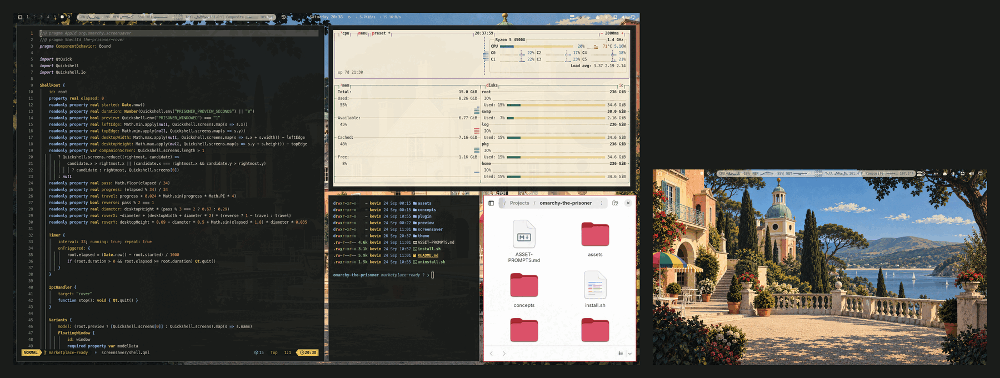

# The Prisoner Seaside Background



An Omarchy desktop-background plugin inspired by the sunlit Village from the
1967 series *The Prisoner*. On multi-monitor desktops, it places an original
seaside Village companion scene on the right-most display. Single-monitor
desktops remain unchanged.

The plugin is intended to accompany the full
[`omarchy-the-prisoner`](https://github.com/MkultraUSA/omarchy-the-prisoner)
theme, but it can be used independently on any Quickshell-based Omarchy setup.

## Install

```sh
omarchy plugin add https://github.com/MkultraUSA/omarchy-the-prisoner-seaside.git --enable
```

Omarchy copies the plugin into `~/.config/omarchy/plugins/` and records its
enabled state in `~/.config/omarchy/shell.json`.

## Remove

```sh
omarchy plugin remove uk.co.mkultrausa.the-prisoner-seaside --yes
```

## Dependencies

None. The plugin is a single QML file and one image. It uses no network access,
no external commands and no privileged operations.

## Compatibility

- Requires a current Quickshell-based Omarchy installation.
- The image is a 3840×2160 PNG and uses `PreserveAspectCrop`, so it scales
  cleanly across common display resolutions.
- The plugin renders only when at least two displays are connected. The
  right-most display is selected from the active monitor layout, with no
  hard-coded connector names.

## Credits and license

The artwork is an original AI-generated illustration inspired by Portmeirion
and the visual language of *The Prisoner*; it does not include television
footage, stills, dialogue, or proprietary typefaces. This is an unofficial
fan work and is not affiliated with the programme's rights holders or
Portmeirion.

The code and artwork in this repository are available under the MIT License.
